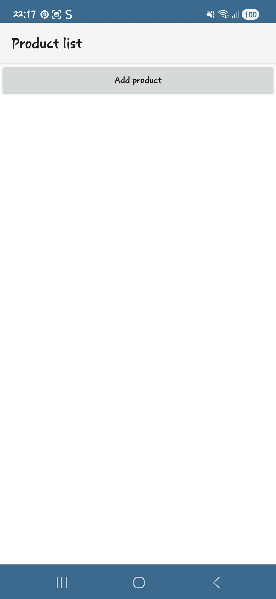
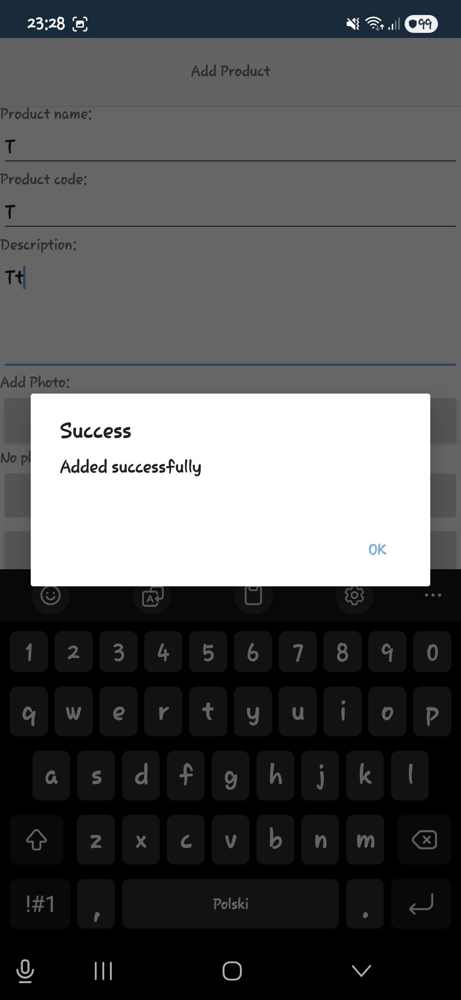
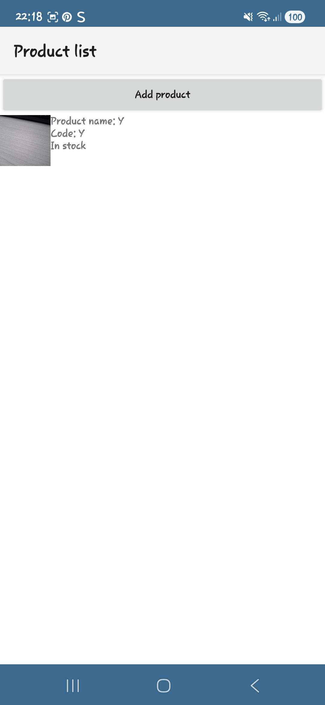
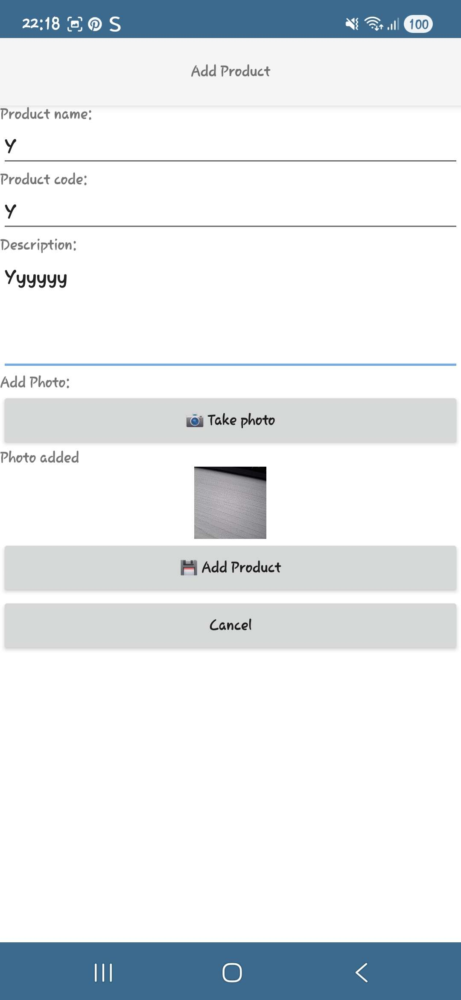
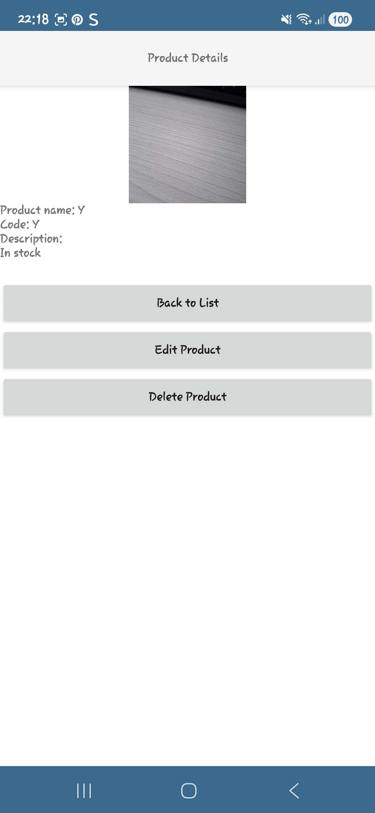
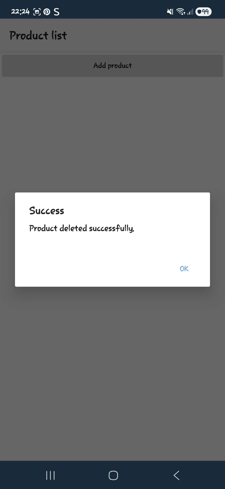
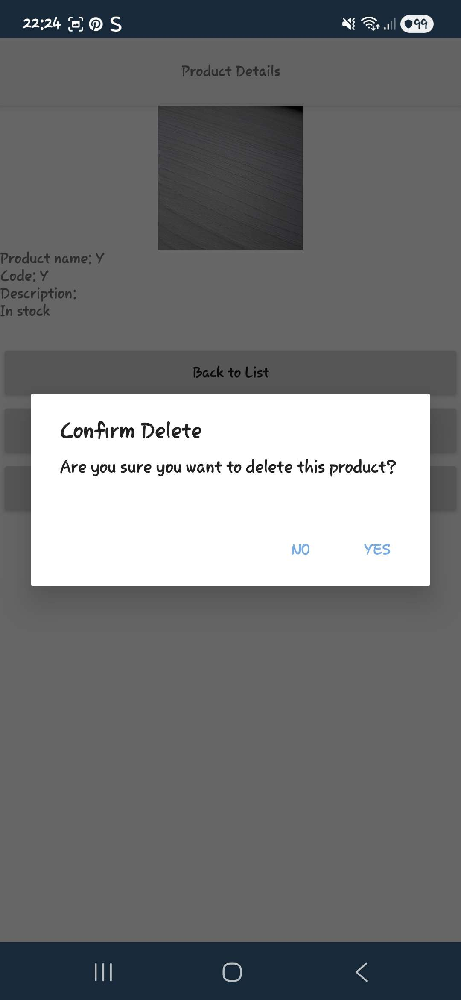
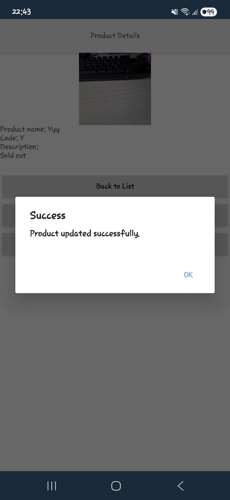
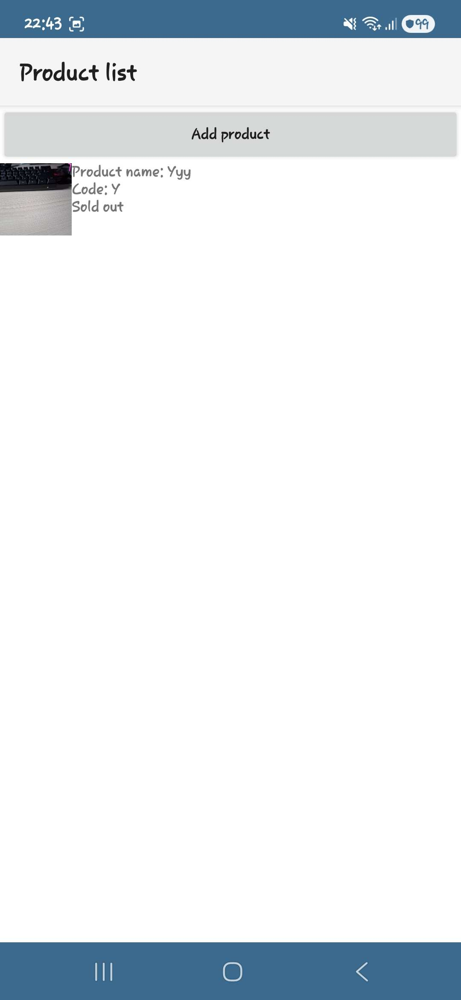

# NativeScript – Scan Inventory

Podstawowa aplikacja mobilna stworzona w **NativeScript + Angular**.  
Aplikacja pozwala dodawać produkty ze zdjęciem, przeglądać je na liście oraz zarządzać szczegółami (edycja, usuwanie). Wykorzystuje kamerę (funkcja natywna) oraz API (POST).

---

## Funkcje aplikacji

### Widoki (3)
1. **Lista produktów** – `home.component.ts` + `home.component.html`  
   Wyświetla wszystkie dodane produkty (nazwa, kod, status oraz zdjęcie jeśli istnieje).
2. **Dodaj produkt** – `product-add.component.ts` + `product-add.component.html` 
Formularz: nazwa, kod, opis + zdjęcie z aparatu (natywna funkcja).
Po dodaniu wykonuje również request POST do API.
3. **Szczegóły** – `product-details.component.ts` + `product-details.component.html`  
   Wyświetla szczegółowe dane wpisu.
---

## Funkcja natywna

Aplikacja korzysta z:
1. **Aparatu** - Pobieranie zdjęcia produktu, wykorzystuje natywne API NativeScript (@nativescript/camera), obsługuje uprawnienie do kamery, prezentuje zrobione zdjęcie w podglądzie

Wybrano tę funkcję, ponieważ aplikacja ma ułatwiać skanowanie/dokumentowanie produktów.
---

## Integracja z API

Aplikacja wykonuje wywołanie:

**POST** → https://jsonplaceholder.typicode.com/posts

Endpoint wykorzystywany jest podczas dodawania produktu.
Logika komunikacji znajduje się w pliku:

`product.service.ts`

Obsługiwane elementy:
poprawny POST, logowanie odpowiedzi z API, obsługa błędów (catchError)

---

## Stan aplikacji

Dane produktów przechowywane są lokalnie w tablicy:
- dodawanie produktu,
- odczyt,
- edycja,
- usuwanie.

Lista renderowana jest w czasie rzeczywistym po każdym dodaniu lub zmianie.

---

## Edge Cases

- brak zgody na kamerę - komunikat i brak możliwości wykonania zdjęcia
- brak nazwy/kodu - komunikat i brak możliwości zapisu
- błędy API - produkt zapisuje się lokalnie + komunikat
- brak produktu o wskazanym ID - wyświetlany pusty ekran/safe handling

---

## Struktura projektu
1. Struktura:
   ```bash
    src/app/
        ├── home/
        │     ├── home.component.ts
        │     └── home.component.html
        │
        ├── product-add/
        │     ├── product-add.component.ts
        │     └── product-add.component.html
        │
        ├── product-details/
        │     ├── product-details.component.ts
        │     └── product-details.component.html
        │
        ├── screenshots/
        │       ├── add.jpg
        │       ├── api.jpg
        │       ├── delete.jpg
        │       ├── deleteconfirm.jpg
        │       ├── details.jpg
        │       ├── emptylist.jpg
        │       ├── list.jpg
        │       ├── update.jpg
        │       └── updatedlist.jpg
        │
        ├── service/
        │     └── product.service.ts   # logika API + lokalny store
        │
        └── app.routes.ts              # routing aplikacji

---

## Jak uruchomić
1. Zainstaluj zależności:
   ```bash
   npm install


2. Uruchom aplikację na androidzie:
   ```bash
   ns run android 


3. Uruchom aplikację na ios:
   ```bash
   ns run ios 

 
---


## Jak przetestować

1. Dodawanie wpisu: Otwórz "Add Product" - wpisz dane - zrób zdjęcie aparatem - Zapisz produkt  
2. Szczegóły: Wejdź w produkt z listy - Sprawdź opis, zdjęcie, status - Sprawdź edycję i usuwanie
5. Brak kamery: Odmów uprawnień - Spróbuj zrobić zdjęcie

## Screenshots

### Lista wpisów




### Dodawanie wpisu


### Szczegóły






## Definition of Done
- [x] 3–4 kompletne widoki zgodne z opisem
- [x] wykorzystano co najmniej 1 funkcję natywną
- [x] integracja z API (min. 1 operacja)
- [x] stany: ładowanie, pusty, błąd
- [x] README + screenshots
- [x] min. 3 commity